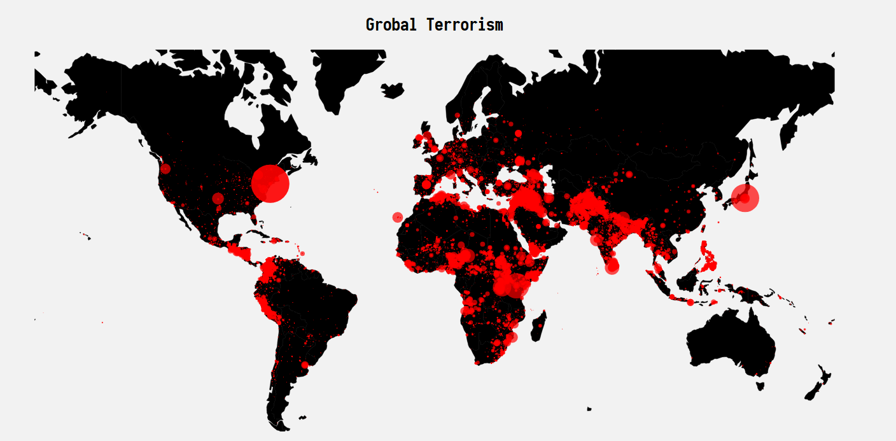
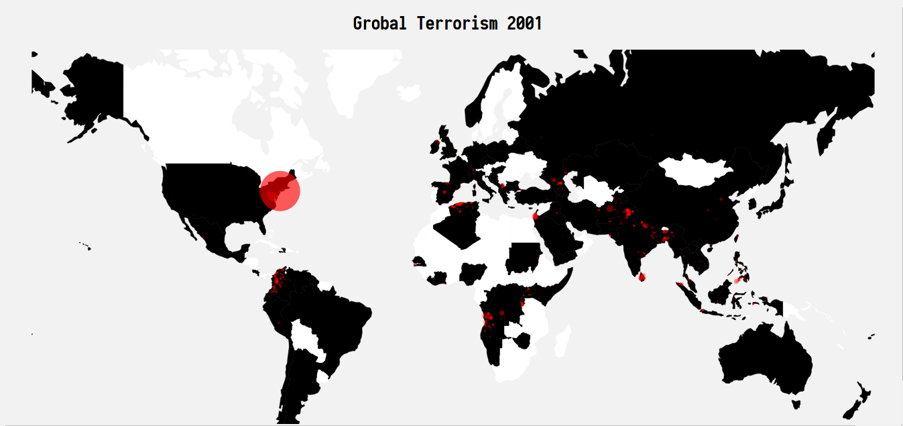
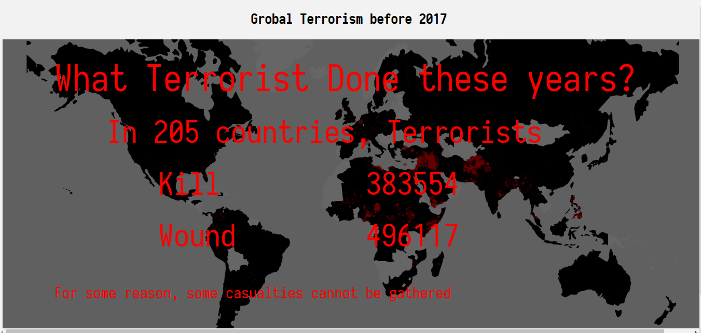
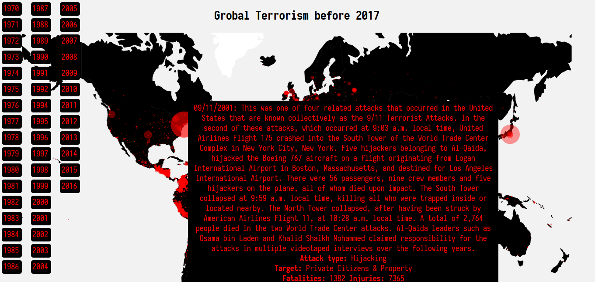
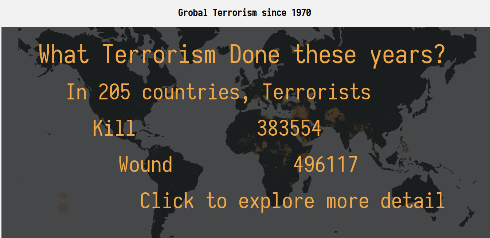
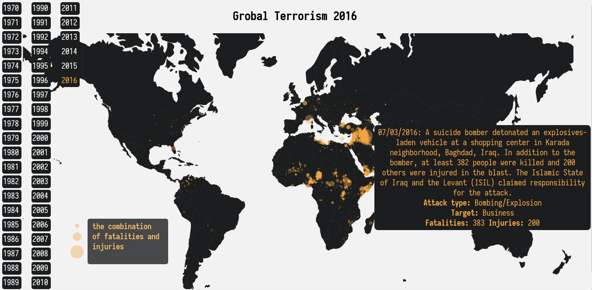

# Global Terrorism Visualization


## Summary
This data Visualization mainly focus on the development of global terrorism from 1970.


## Design

### EDA and cleaning(Jupyter Notebook)
The dataset is Global Terrorism Database downloading from [Kaggle's Global Terrorism Database](https://www.kaggle.com/START-UMD/gtd)

The raw dataset have 135 variables and 170350 observations.

I select 18 variables and renames them.

variables | renames
---- | -----
"eventid" | "id"
'iyear' |'year'
'imonth' |'month'
'iday' |'day'
'country_txt' |'country'
'attacktype1_txt' |'attacktype'
'targtype1_txt' |'target'
'weaptype1_txt' |'weapon'
'gname' | 'group'
'nkill' |'fatalities'
'nwound' |'injuries'

And them I use 0 to replace the Nan in
 * fatalities
 * injuries

Last but not least, I filtered the longitude and latitude before export the dataset into csv.

The detail of other plots are showed in Jupyter Notebook, I mainly focus on the development of global terrorism from 1970.

# The Development of Global Terrorism since 1970.

At first, I just plot all the event points on world map using [world.geo.json](https://github.com/johan/world.geo.json).

And then I design an indicator to represent the event severity:  
```
intensity = fatalities + injuries * 0.5 + 1  
```
because there are no casualties in some events, so the intensity add 1 as base. I just use that indicator as circle area on the map.


After that, I animate the event points on map with year so that the development of global terrorism emerged. In this animation, 1993 have no data points, so I just remove it.

Furthermore, I animate the countries on the map so that the country color become black when there is terrorism event otherwise white. In this way, the  development of global terrorism can be presented more clear. But I found a problem in this animation, some countries with terrorism event still keep white color. I repair partial of this bug by manually changing some countries name in GTB file to be the same in countries.geo.json file.



After the history development per year, I plot all event points on the map. But since this is a big dataset with 165744 rows after filtering longitude and latitude, it would take long time to render all points on the map. So I decide to use a rectangle mask with some text on it before the final plot.



What is more, for better interaction, I add sidebar with all the years and tooltips with event summary, attacktype, target, fatalities and injuries.



In the end, after careful consideration, I decided to discard the dynamic map feature and the final map with all data points.

And then make a little change to the text mask- rename the title from "Global Terrorism before 2017" to "Global Terrorism since 1970", and then add a sentence to encourage the reader to explore the map by themselves.



Last but not least, I adjust the theme and add the legend.



# Major Findings

 1. the most conspicuous event is 911 in 2001.
 2. the global terrorism has developed alarmingly to almost all the corners of world. Actually, the terrorism activities already happened in 205 countries.
 3. The middle East and Africa are the hardest-hit areas and become worse and worse.
 4. There were lots of terrorism actions in Central America in 1980-1990 years. (Probably related to drugs creating activity in these years)

# Feedback
1. The most conspicuous events I noticed are 911 in 2001 and unknown Japan event in 1995. It take a long time to see the final result plot Global Terrorism before 2017. Why not just discard it. And Why Global Terrorism 1993 is a all blank white world map? If there is no data in 1993, I think it is meaningless to keep it.
2. That's super cool, I haven't realize that the terrorism is so rampant without your map. There are no terrorism activities in Mongolia. Amazing! Is that the only country keep terrorism away? BTW, what your circle radius represent?
3. There are so many terrorism activities missed information. I mean just like 911, there is a long description, but many events have no such summary description.
The map just refresh my impression on terrorism. I have no idea that there are so many terrorism activities around the Philippines, Pakistan and Africa. Good job, impressing!

# Resources
https://github.com/d3/d3/wiki/transitions  
https://github.com/d3/d3-interpolate  
http://4waisenkinder.de/blog/2014/05/11/d3-dot-js-tween-in-detail/  
https://bl.ocks.org/mbostock/7004f92cac972edef365  
https://stackoverflow.com/questions/20644415/d3-appending-text-to-a-svg-rectangle  
http://www.worldatlas.com/webimage/countrys/eu.htm  
https://en.wikipedia.org/wiki/Southeast_Europe  
https://stackoverflow.com/questions/30174251/how-d3-key-function-in-data-binding-works  
https://matplotlib.org/users/colors.html  
http://pandas.pydata.org/pandas-docs/version/0.20/generated/pandas.to_datetime.html  
